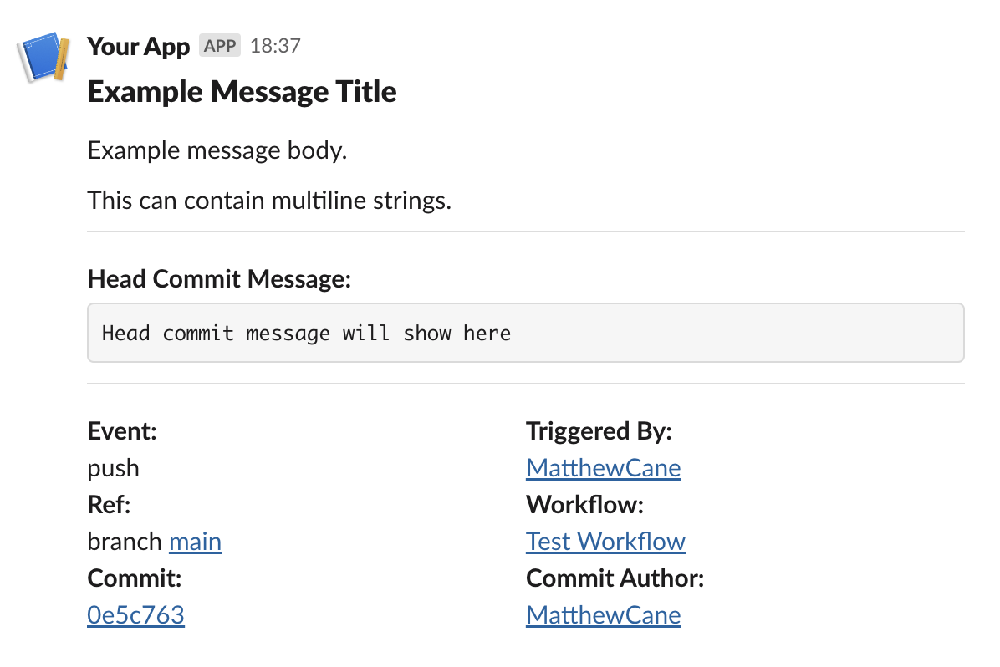

# Send Slack Notification Action

**Send a notification to Slack in one action.** This action can be used to send customized notifications to Slack channels with information about the GitHub workflow run and job failures.



By default, it will send a notification with the following information with links where available:

- Custom title and message
- Head commit message
- Event type
- Triggering user
- Ref (Branch or Tag)
- Workflow run
- Commit hash
- Commit author

If a job within the workflow run fails, the action will reply to the original message with a list of failed jobs:


## Authentication

To use this action, you need to provide a Slack bot token with the necessary permissions to post messages to the specified channel(s).

## Inputs

| Input             | Description                                                     | Required |
| ----------------- | --------------------------------------------------------------- | -------- |
| `title`           | Title of the notification                                       | Yes      |
| `message`         | Message body                                                    | Yes      |
| `channel_id`      | Comma separated list of channel IDs to send the notification to | Yes      |
| `slack_bot_token` | Slack bot token                                                 | Yes      |

> [!TIP]
> For Citizens Advice repositories there is an organisation-wide secret `SLACK_BOT_TOKEN` which you can use in private repositories for `slack_bot_token` input. For example, `slack_bot_token: ${{ secrets.SLACK_BOT_TOKEN }}`

## Outputs

| Output       | Description             |
| ------------ | ----------------------- |
| `message_ts` | Slack message timestamp |

## Example usage

```yaml
name: Deploy
on:
  push:
    branches:
      - main

jobs:
  deploy:
    name: Run Deployment
    runs-on: ubuntu-latest
    steps:
      - name: Deploy Environment
        run: deploy_environment()

  notify:
    name: Send Slack Notification
    runs-on: ubuntu-latest
    needs: deploy
    steps:
      - name: Notify Slack
        uses: citizensadvice/message-slack-action@v1
        with:
          title: 'Deployment Success'
          message: 'The deployment has succeeded'
          channel_id: 'C0123456789'
          slack_bot_token: ${{ secrets.SLACK_BOT_TOKEN }}
          github_token: ${{ secrets.GITHUB_TOKEN }}

  notify-failure:
    name: Notify Slack on Failure
    runs-on: ubuntu-latest
    needs: deploy
    if: failure()
    steps:
      - name: Notify Slack
        uses: citizensadvice/message-slack-action@v1
        with:
          title: 'Deployment Failed'
          message: 'The deployment has failed. Please check the details below.'
          failure: 'true'
          channel_id: 'C0123456789'
          slack_bot_token: ${{ secrets.SLACK_BOT_TOKEN }}
          github_token: ${{ secrets.GITHUB_TOKEN }}
```

## Releases

The release `v1` will be updated to point to a new tag when bug fixes are made. This is done with:

`git tag -f v1 && git push --tags --force`

New releases will be create if the interfaces are changed.
